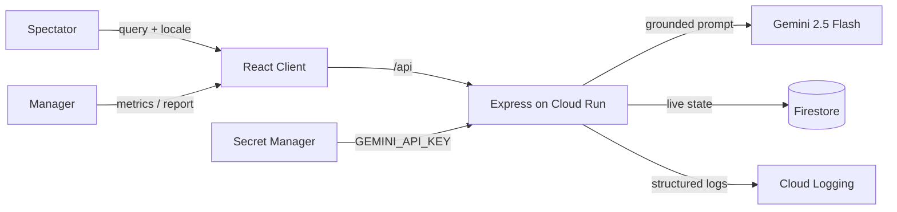

# SmartStadium — Intelligent Venue & Event Management

SmartStadium is an AI-powered platform for the **FIFA World Cup 2026** designed to streamline stadium operations and enhance the spectator matchday experience at Estadio Azteca. Spectators receive grounded navigation, public transit directions, and step-free accessibility support; coordinators leverage live crowd logs, incident alerts, and GenAI situation reports for real-time decisions.

**Live demo:** <https://smartstadium-851755555005.asia-south1.run.app>
**Region:** asia-south1 · **GCP project:** week-4-501612 · **Owner:** Vinay Bhadane

---

## Challenge Guidelines Alignment

SmartStadium covers the main operational themes of the tournament with working, production-grade features:

| Ref | Focus Area | Solution Delivery | Interactive View |
| --- | ---------- | ----------------- | ---------------- |
| R1  | **Navigation** | Guide generates verified wayfinding: matching gate entries to seat stands and step-free pathways. | `/assistant` (Match Guide) |
| R2  | **Crowd management** | Command board showcases sector occupancy levels categorized as comfortable, busy, or critical, with AI action steps. | `/operations` (Command Hub) |
| R3  | **Accessibility** | Prioritizes step-free requests (elevators, quiet spaces) using a fully contrast-compliant WCAG 2.1 AA UI. | `/assistant` + entire portal |
| R4  | **Transportation** | Spectator guide assists with light rail, Fan Shuttle routes, local buses, drop-offs, and pre-booked parking details. | `/assistant` (Match Guide) |
| R5  | **Sustainability** | Ecological tracking gauges (landfill waste diversion, energy use, bottle refilling, carbon offsets) and AI-driven recommendations. | `/operations` (Command Hub) |
| R6  | **Multilingual support** | Multilingual assistant answers in English, Spanish, French, Portuguese, and Arabic. | `/assistant` (Match Guide) |
| R7  | **Operational intelligence** | Aggregated real-time metrics (sectors, logged issues, ecological performance) synchronized directly with Firestore. | `/operations` (Command Hub) |
| R8  | **Real-time decision support** | Situation report tool parses current metrics into prioritized crowd directives, security actions, and eco observations. | `/operations` (Command Hub) |

---

## Capabilities

- **Match Day Guide** (`/assistant`) — A multilingual spectator assistant grounded on verified stadium layouts. Features quick chips for popular queries, a locale picker, and automated priority routing for mobility-challenged fans.
- **Event Command Hub** (`/operations`) — An operations interface outlining crowd levels, safety logs, and carbon counters. Coordinates an on-demand **AI Situation Report** that assesses active stadium documents to recommend operational directives.

---

## Directory Organization

We follow a feature-folder layout inside an npm workspaces monorepo:

```text
smartstadium/
├── server/                       Node 22 · Express 5 · TypeScript
│   └── src/
│       ├── config/               config.ts (zod-validated) + constants.ts
│       ├── lib/                  firestore · gemini · logger · app-error · ttl-cache
│       ├── middleware/           error-handler · validate · rate-limit
│       └── features/
│           ├── stadium/          arena data + amenities API
│           ├── assistant/        multilingual grounded Q&A (Gemini)
│           └── operations/       live data snapshots, crowd simulation, situation reports
├── client/                       React 19 · TypeScript · Vite
│   └── src/
│       ├── components/           AppLayout · ErrorBoundary · StatusMessage
│       ├── lib/                  typed API client
│       └── features/
│           ├── home/             landing page
│           ├── assistant/        MatchGuidePage + hook + sub-components
│           └── operations/       CommandHubPage + hook + sub-components
├── docs/decisions.md             architecture decision records
├── scripts/preflight.sh          pre-submission audit
└── Dockerfile                    multi-stage build → single Cloud Run service
```



### Endpoints

| Method + URI | Function |
| --- | --- |
| `GET /api/health` | Liveness indicator + version |
| `GET /api/stadium/facilities?category=` | Retreive guest amenities for quick selection |
| `POST /api/assistant/ask` | Retrieve a grounded, translated response (Gemini) |
| `GET /api/operations/snapshot` | Fetch live sectors, incidents, and carbon indicators |
| `POST /api/operations/briefing` | Request an AI situation report (Gemini) |

---

## Engineering Environment

React 19 · TypeScript 5.8 (strict) · Vite 7 · React Router 7 · Node 22 · Express 5 · Zod · `@google/genai` (Gemini 2.5 Flash) · `@google-cloud/firestore` · Helmet · Pino · Vitest · Testing Library · Cloud Run · Secret Manager · Firestore · Cloud Logging.

---

## Quick Start

```bash
# 1. Install dependencies (workspace layout)
npm install

# 2. Add local configuration
cp .env.example .env      # supply your GEMINI_API_KEY

# 3. Start development server (:8080) and client (:5173) in separate shells
npm run dev:server
npm run dev:client
```

Root-level task aliases: `build` · `lint` · `typecheck` · `test` · `test:coverage` · `format`.

---

## Testing Verification

Initiate unit tests with `npm run test:coverage`. We maintain strict 90%+ line, function, and branch coverage limits inside workspace configurations.

- **Server Workspace — 54 tests, 97% line coverage.** Integrates environment validation, caches, Google GenAI client (timeouts, retries, upstream errors), and venue layouts. Hermetic runs fake Firestore access in process memory.
- **Client Workspace — 24 tests, 98% line coverage.** Validates guide dialogues (question prompts, locale chips, quick queries, failure warnings), operations dashboard (real-time gauges, incident logs, reporting), routes, and fallback screens.

---

## Security Practices

Full threat vectors are documented in [SECURITY.md](SECURITY.md).

- **Secrets**: API credentials reside safely inside Google Secret Manager and load as container variables via `--set-secrets`.
- **Input Validation**: Hardened boundaries run incoming payloads against strict Zod parsing schemas to filter unrecognized properties.
- **HTTP Hardening**: Restricted CSP headers via Helmet, explicit CORS origins, 100 kB JSON body limit, and rate throttles on standard and GenAI endpoints.
- **Prompt Isolation**: Guided queries utilize context injections restricting model answers to stadium documentation.
- **Error Sanitization**: App failures filter through a global handler to output safe `{ code, message }` responses.

---

## Optimization

- **Route Lazy-Loading**: Split views ensure pages load dynamically, shrinking the initial bundle to ~78 kB gzip.
- **Compression & Caching**: Employs `compression()` gzip middleware and asset-hashed caching headers.
- **Connection Re-use**: Instantiated Gemini and Firestore client bindings persist across incoming requests.
- **In-Memory Caching**: Bounded TTL cache stores protect Gemini endpoints from repetitive inputs.

---

## Accessibility Compliance

Validated using axe-core and Lighthouse against **WCAG 2.1 AA** standards.

- Structural landmarks (`header`, `nav`, `main`) and keyboard skip actions are present.
- Every control has a programmatic label; accessible key binds allow total tab traversal.
- Live areas (`aria-live`) announce dynamic guide and situation updates.
- Status values use text tags next to color pills to avoid color-only indicator dependency.

---

## Google Cloud Specifications

All services utilize their official Google Cloud Platform Node.js SDK wrappers.

| Service | Application Role | Configuration |
| --- | --- | --- |
| **Cloud Run** | Hosts containerized portal (API + React), min-instances=1, region: asia-south1. | `Dockerfile` |
| **Gemini (`@google/genai`)** | Outputs translated guide answers and situations reports. | `server/src/lib/gemini.ts` |
| **Firestore** | Stores real-time spectator areas, safety logs, and green metrics. | `server/src/lib/firestore.ts` |
| **Secret Manager** | Mounts the secret `GEMINI_API_KEY` directly inside the container instance. | deploy configuration |
| **Cloud Logging** | Consumes severity-labeled structured JSON outputs from stdout. | `server/src/lib/logger.ts` |

---

## License

Code is licensed under the [MIT License](LICENSE).
